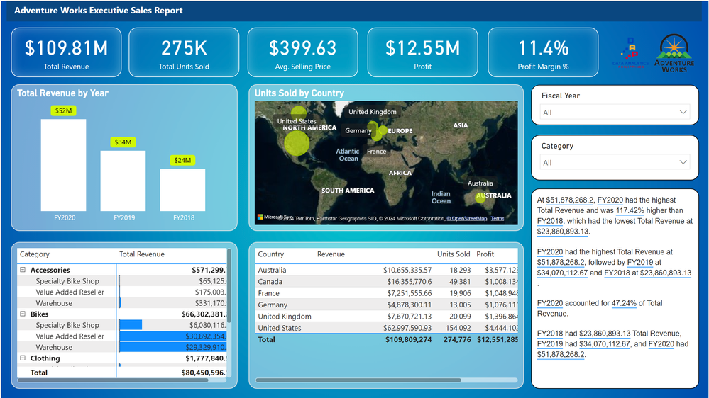

# Business Intelligence With Power BI Desktop (End-to-End-Solutions)

## Project Overview

This project demonstrates a comprehensive solution using Power BI Desktop to provide insightful and interactive dashboards for the CFO and Sales Manager of Adventure Works Bike Shop. The goal is to capture and visualize key business metrics and trends to facilitate data-driven decision-making.

## Skills Demonstrated

1. Prepare the Data

    * Data extraction, transformation, and loading (ETL) processes.

    * Data cleaning and integration from multiple sources.

2. Data Modeling

    *  Creating relationships between datasets.

    *  Developing calculated columns and measures using DAX.

3. Visualize and Analyze the Data

    *  Designing intuitive and interactive dashboards.

    *  Implementing various visualizations (charts, graphs, maps) for detailed analysis.

4. Deploy and Maintain the Dashboard

    *  Publishing the report to Power BI Service.

    *  Configuring scheduled refreshes and user access controls.

## Key Deliverables

1. Revenue Trend by Year

    *  A line chart displaying the annual revenue trend.

    *  Insights into growth patterns over the years.

2. Slicing & Dicing for Category & Business Units

    *  Interactive filters for product categories and business units.

    *  Drill-down capabilities for granular analysis.

3. Geographical Analysis (Maps)

    *  A map visualization showing units sold by country.

    *  Geographic distribution insights to identify high-performing regions.

4. Detailed Table by Country

    A table providing country-wise details:

    *  Revenue

    *  Units Sold

    *  Profit

    *  Profit Margin %

## Project Output

## Certificate

## Task Description Email
[Email Task](<Email - Welcome and Task Description.pdf>)
